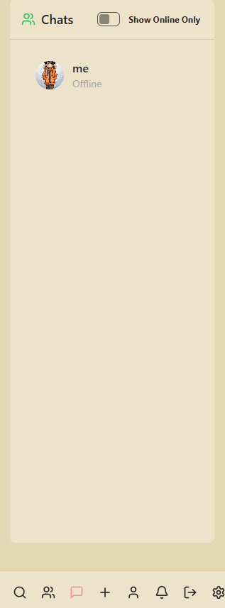
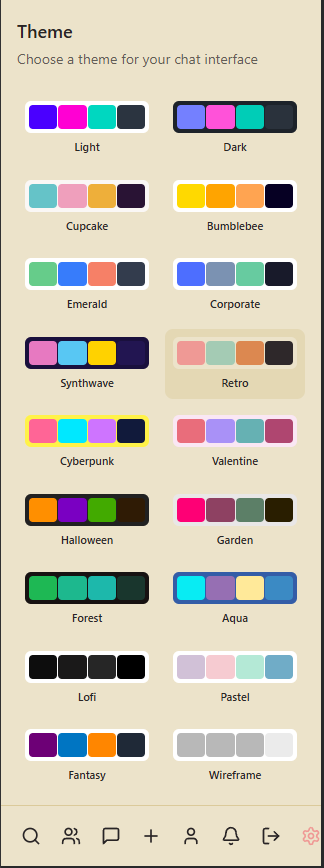
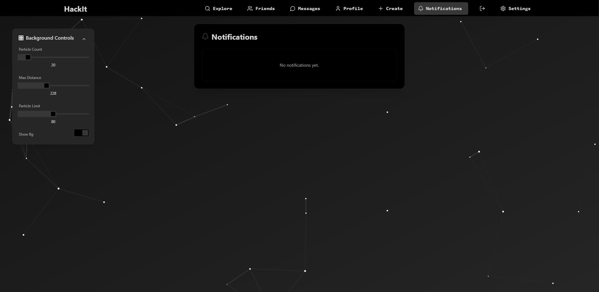
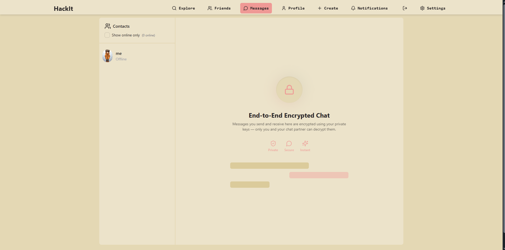
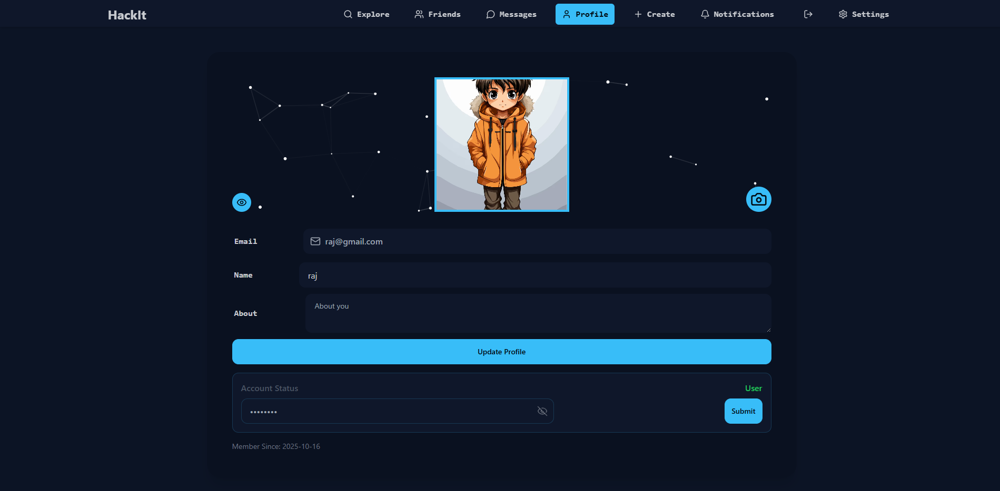
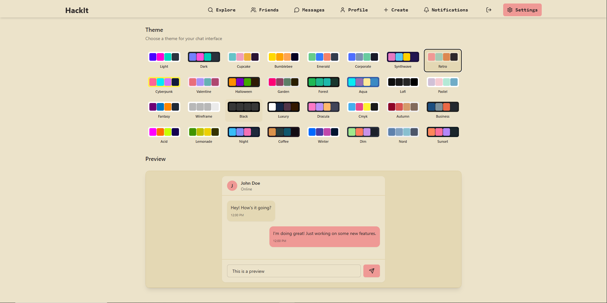
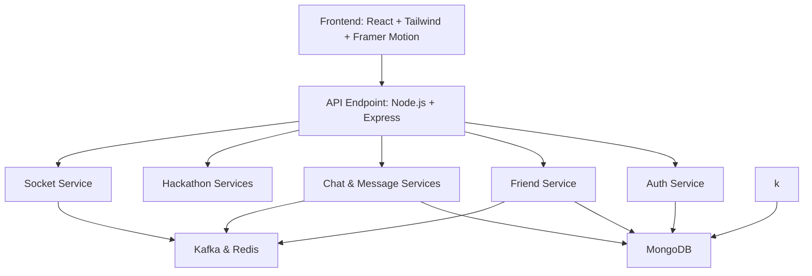

# HackIT 🚀💬

  
  
  

**HackIT** is a **microservice-based real-time chat platform** designed for **instant messaging, notifications, friend management, and cross-device communication**. Built with **Node.js, React, MongoDB, Kafka, Redis, BullMq, Docker and WebSockets**, HackIT demonstrates a **scalable and modular architecture** for modern chat apps.  

---

## 🎯 Goal & Innovation  

HackIT isn’t just a chat app—it’s a **platform designed to help developers step out of their comfort zone and thrive in hackathons**.  

- 🚀 **Discover Hackathons:** HackIT helps you find hackathons and coding events, making it easier to participate and gain real-world experience.  
- 🤝 **Make Friends & Collaborate:** Join project chats, send friend requests, and collaborate with peers, reducing the fear of networking alone.  
- 💡 **Overcome Fear:** By providing a supportive environment with instant communication and complete privacy over your messages, HackIT encourages new developers to **take the leap into competitive coding events without hesitation**.  
- 🌐 **All-in-One Workspace:** Real-time messaging, notifications, project management, and microservice architecture ensure a **smooth, interactive, and responsive experience**, letting users focus on coding, collaboration, and learning rather than logistics.  

**Innovation:** HackIT merges **social networking, event discovery, and collaborative coding** into one **microservice-based, real-time platform**, making it easier for developers to **participate, learn, and grow** in hackathons—all while building lasting connections. 💬✨

---

## ✨ Features  

### 🔐 Authentication & Security  
- ✅ User signup/login with **JWT**  
- 🔄 Persistent sessions with cookies  

### 💬 Real-Time Chat  
- 🗣️ Completely **End to End Encrypted** chats using **Socket.IO**  
- 👀 Seen/unseen message indicators  
- ✏️ Edit/delete messages  
- 🔔 Live notifications  

### 👥 Friends & Presence  
- ✅ Send/accept/reject friend requests all in real time
- 🟢 Online/offline status updates  

### 🛠 Microservices Architecture  
- 🏗 Each service runs independently:  
  - **Auth Service** – User authentication  
  - **Friend Service** – Friend connections  
  - **Chat & Message Services** – Messaging and queuing  
  - **Socket Service** – Real-time events  
  - **API Endpoint** – Unified API gateway  

### ⚡ Performance  
- 📦 Redis caching for speed  
- 🔄 Background jobs and event processing  
- 📊 Indexed MongoDB schemas  
- 🎨 Responsive UI with **Framer Motion**  

---

## 🖼️ Screenshots

| Chat | Mobile View |
|------|------------|
|  |  |

| Notifications | PC Chat |
|---------------|---------|
|  |  |

| Profile | Settings |
|---------|---------|
|  |  |

---

## 🛠 Tech Stack  

| Layer           | Technologies                                      |
| --------------- | ------------------------------------------------- |
| **Frontend**    | React, Tailwind CSS, Framer Motion               |
| **Backend**     | Node.js, Express                                 |
| **Database**    | MongoDB , Redis                                        |
| **Real-Time**   | Socket.IO                                        |
| **Video Calls** | Stream API                                       |
| **Caching**     | Redis                                            |
| **Auth**        | JWT + Secure Cookies                             |
| **Hosting**     | Locally with Docker containers                                           |
| **Background-Jobs and messsaging**   | BullMq, Kafka                      |
---

## 💡 How It Works

HackIT is designed with **context-awareness** in mind. It keeps track of **previous messages and chats** to provide smooth and coherent conversation flows. The backend microservices handle:

- **Authentication & Authorization**  
- **Friend Management**  
- **Message Delivery & Queuing (via Kafka)**  
- **Real-time Socket Communication**  

The frontend consumes these services via **REST and WebSocket endpoints**, providing a unified experience.

---

## ⚠️ Why HackIT Is Not Hosted

HackIT currently is **not hosted online** due to the complexity of its microservice architecture:

- It has multiple **services running on different ports** (auth, chat, friend, message).  
- Requires **Kafka, Redis, and MongoDB** as dependencies.  
- Hosting all microservices together on a single platform is non-trivial without a **cloud container orchestration service** (like AWS ECS, Kubernetes, or Docker Compose with a cloud VM).  

Currently, it runs locally using:

```bash
# Backend
git clone https://github.com/Raj-dev08/HackIT
cd backend
docker-compose up

cd ..
cd frontend

# Frontend
npm run dev

```

--- 

## 🏗 Architecture  


---
